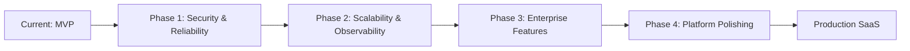

# SentinelAI — Complete Codebase Audit & Production Readiness Report

**Generated:** May 27, 2026
**Scope:** Full frontend + backend + infrastructure analysis
**Purpose:** Transform prototype/MVP into production-grade enterprise SaaS

---

## 1. Executive Summary

SentinelAI has a **solid architectural foundation** but is **not production-ready**. The backend risk detection pipeline is functional, the multi-tenant data model is well-designed, and Clerk authentication is properly integrated. However, the platform suffers from:

- **~40% of frontend pages use mocked/hardcoded data**
- **Critical security vulnerabilities** (unsigned JWT fallback, unauthenticated settings endpoints, CORS `*`)
- **No real enforcement actions** — `BLOCK`/`ESCALATE` only return metadata
- **Parallel dashboard implementations** creating maintenance debt
- **Empty workspace intelligence features** (incidents, deployments, integrations — 0 rows)
- **No billing, no rate limiting, no background jobs, no caching**

The system is currently a **functional MVP** that demonstrates the core value proposition but needs significant work across security, reliability, enterprise features, and collaboration infrastructure.

---

## 2. System Architecture Overview

### 2.1 Frontend Architecture

```
Next.js 14 (App Router) + TypeScript + Clerk Auth
├── (public)     — Landing, Start, Docs (static marketing)
├── (auth)       — Clerk sign-in/sign-up, org-onboarding
├── (dashboard)  — Post-auth routing, LEGACY org routes (40% MOCKED)
├── (org)        — REAL org dashboard (sidebar, full API integration)
└── (setup)      — 6-step org setup wizard
```

**State Management:** React Context (`OrganizationProvider`, `WorkspaceProvider`) + React Query + localStorage
**API Client:** `fetch`-based `apiGet`/`apiPost`/`apiPatch`/`apiDelete` with Bearer token injection
**UI:** TailwindCSS + shadcn/ui + Framer Motion + Recharts

### 2.2 Backend Architecture

```
FastAPI + SQLAlchemy + Clerk JWT Auth
├── /api/analyze          — Risk detection pipeline
├── /api/orgs/{org_id}    — Multi-tenant management
├── /api/workspaces       — Workspace CRUD
├── /api/api-keys         — API key management
├── /api/members          — Invite/role management
├── /api/usage            — Usage analytics
├── /api/learning         — Feedback & compliance
├── /api/baselines        — Prompt baselines (NO AUTH!)
├── /api/settings         — System settings (NO AUTH!)
└── /api/workspaces/intel — Intelligence/incidents
```

**Database:** PostgreSQL (primary) with SQLite fallback; 33 tables in current SQLite DB
**Auth:** Clerk JWT (RS256) for user auth; API key (SHA-256) for external access; legacy admin token
**Pipeline:** Signal Detection → Aggregation → Reasoning → Policy → Action Execution → Logging

### 2.3 How Components Communicate

```
User → Next.js → Clerk (auth) → API Rewrite → FastAPI → SQLAlchemy → SQLite/PostgreSQL
                          ↕ (Bearer token via middleware)
External App → SDK → /api/analyze/external → API Key Auth → Same Pipeline
```

### 2.4 Data Flow (Risk Analysis Pipeline)

```
POST /api/analyze {prompt, response}
  → SignalRegistry.detect_all()
    ├── PromptAnomalyDetector (Jaccard similarity + keyword + length heuristics)
    ├── JailbreakRAGDetector (sentence-transformers cosine similarity)
    └── OutputRiskScorer (regex pattern matching, 8 categories)
  → RiskAggregator (max severity + synergy bonus)
  → RiskReasoner (classify risk, generate explanation)
  → PolicyEngine (evaluate thresholds, determine action)
  → ActionExecutor (dispatch allow/warn/block/escalate)
  → RiskLog persistence + UsageEvent + AuditLog
```

---

## 3. Feature Status Matrix

### 3.1 Core AI Features

| Feature | Status | Fully Working | Partial | Mocked | Missing Backend | Missing Frontend | Notes |
|---|---|---|---|---|---|---|---|
| Prompt Analysis | ✅ | ✅ | — | — | — | — | Heuristic + embedding-based |
| Risk Scoring | ✅ | ✅ | — | — | — | — | Weighted signal aggregation |
| Explainability | ✅ | ✅ | — | — | — | — | Decision reasons generated |
| Audit Logs | ✅ | ✅ | — | — | — | — | RiskLog model with full audit trail |
| Threat Classification | ⚠️ | — | ✅ | — | Pattern severity per category | Category display | Tags as `flags` only |
| AI Monitoring | ⚠️ | — | ✅ | — | No real-time dashboards | Real-time views | Stats-based only |
| Historical Analysis | ⚠️ | — | ✅ | — | No aggregation queries | Charts work | Basic time-series |
| Baseline Management | ⚠️ | ✅ | — | — | — | — | No auth on baselines API |

### 3.2 Organization Features

| Feature | Status | Fully Working | Partial | Mocked | Missing Backend | Missing Frontend | Notes |
|---|---|---|---|---|---|---|---|
| Organizations | ✅ | ✅ | — | — | — | — | CRUD with membership |
| Workspaces | ✅ | ✅ | — | — | — | — | CRUD with default workspace |
| Members | ✅ | ✅ | — | — | — | — | Full invite/role/remove |
| Invitations | ✅ | ✅ | — | — | — | — | Email invites + token accept |
| Role-Based Access | ⚠️ | — | ✅ | — | Only 9 permissions defined | Role UI works | Sparse permission coverage |
| Workspace Switching | ✅ | ✅ | — | — | — | — | Context + localStorage |
| Team Analytics | ❌ | — | — | — | No team dashboards | Mocked on legacy | Only per-user analytics |
| Shared Dashboards | ❌ | — | — | — | Not implemented | Not implemented | — |
| Notifications | ❌ | — | — | — | No notification system | Mocked on settings page | — |
| Activity Feeds | ⚠️ | — | ✅ | — | Activity feed table exists (0 rows) | Component exists | Empty/unused |

### 3.3 Collaboration Features

| Feature | Status | Fully Working | Partial | Mocked | Missing Backend | Missing Frontend | Notes |
|---|---|---|---|---|---|---|---|
| Slack Integration | ❌ | — | — | — | No Slack API code | — | — |
| Discord Integration | ❌ | — | — | — | No Discord API code | — | — |
| Webhooks | ❌ | — | — | — | No webhook system | Mocked on settings page | — |
| MCP Servers | ❌ | — | — | — | Not implemented | — | — |
| Shared Incident Response | ❌ | — | — | — | Incident tables exist (0 rows) | Intel components exist | Schema built, no data |
| Team Comments | ❌ | — | — | — | Not implemented | — | — |
| Alert Routing | ❌ | — | — | — | No routing logic | — | — |
| Multi-User Sessions | ❌ | — | — | — | No session management | — | Basic Clerk sessions only |

### 3.4 Enterprise Features

| Feature | Status | Fully Working | Partial | Mocked | Missing Backend | Missing Frontend | Notes |
|---|---|---|---|---|---|---|---|
| API Keys | ✅ | ✅ | — | — | — | — | Full lifecycle (create/rotate/revoke) |
| Billing | ❌ | — | — | — | PlanTier enum but no billing | Mocked usage page | No Stripe/invoicing |
| Usage Tracking | ✅ | ✅ | — | — | — | — | UsageEvent model with aggregation |
| SSO | ❌ | — | — | — | Clerk supports SSO but not configured | — | Requires Enterprise Clerk plan |
| Access Policies | ❌ | — | — | — | PolicyEngine exists but not for access | — | Only for risk decisions |
| Compliance Exports | ❌ | — | — | — | Not implemented | — | — |
| Rate Limiting | ❌ | — | — | — | Not implemented | — | No protection on any endpoint |
| Tenant Isolation | ⚠️ | — | ✅ | — | Org-scoped queries but X-Org-Id header fragile | Workspace context works | No encryption per tenant |

---

## 4. Mock Feature Detection Report

### 4.1 Frontend Pages Using Mocked Data

| Page | File | Mock Type | Details |
|---|---|---|---|
| User Activity Logs | `app/(dashboard)/user/logs/page.tsx` | Hardcoded array | `const mockLogs = [...]` with setTimeout "loading" |
| Org Logs (legacy) | `app/(dashboard)/org/[orgId]/logs/page.tsx` | Hardcoded array | Same pattern — mock data with delay |
| Org API Keys (legacy) | `app/(dashboard)/org/[orgId]/api-keys/page.tsx` | Hardcoded + local state | Create/revoke only updates local React state |
| Org Usage (legacy) | `app/(dashboard)/org/[orgId]/usage/page.tsx` | Random generation | `Math.random()` metrics + static billing |
| Org Settings (legacy) | `app/(dashboard)/org/[orgId]/settings/page.tsx` | Local state | Save uses `setTimeout` + `alert()` |
| Org Baselines (legacy) | `app/(dashboard)/org/[orgId]/baselines/page.tsx` | Local state | Same pattern — local state only |
| User Profile Save | `app/(dashboard)/user/profile/page.tsx` | Local simulation | Shows toast but no API call |
| SDK Documentation | `app/(public)/docs/page.tsx` | Static hardcoded | `@sentinel-ai/sdk` package doesn't exist; API URLs are aspirational |
| Hooks index | `app/hooks/index.ts` | Placeholder | Returns `null`/`[]` with TODO comments |

### 4.2 Why These Are Mocked

The legacy dashboard under `app/(dashboard)/org/[orgId]/` was the **first UI iteration** built before the backend APIs were complete. When the real org dashboard was built under `app/(org)/org/[orgId]/dashboard/`, these legacy pages were **never removed or connected** to real data. They exist as dead code.

**What's needed to fix:**
- Remove the legacy mocked pages (or connect them to real APIs)
- The real dashboard under `(org)` already has proper API calls — the mocked pages are duplicates

### 4.3 Backend Mock/Placeholder Features

| Feature | File | Mock Type | Details |
|---|---|---|---|
| Firebase Cloud Functions | `functions/` | Empty directory | `.gitkeep` only — no actual functions |
| Workspace Intelligence | DB tables | Empty tables | incidents, deployments, integrations all have 0 rows |
| Baseline Config Read | `orgs_routes.py` | Hardcoded defaults | `GET /orgs/{org_id}/baselines` returns hardcoded values, ignores stored config |
| Action Enforcement | `executor.py` | Metadata-only | BLOCK/ESCALATE don't actually block or notify — just return response |
| Settings (legacy file) | `settings.json` | Orphaned | DB-backed settings exist; file-based settings are unused |
| User Profile | `main.py` debug endpoint | Dev-only | Test email endpoint behind `DEBUG_ADMIN_TOKEN` |
| SDK Packages | `docs/page.tsx` | Aspirational | `@sentinel-ai/sdk` npm package and `sentinel-ai` pip package don't exist |

---

## 5. Organization & Workspace Flow Audit

### 5.1 Real (Functional) Flows

- **Organization Creation:** `POST /api/orgs` → creates org + default workspace + adds creator as OWNER → returns org ID
- **Workspace Listing:** `GET /api/workspaces` → returns user's workspaces across orgs
- **Workspace Creation:** `POST /api/workspaces` → creates workspace with default roles
- **Member Invitation:** `POST /orgs/{org_id}/members/invite` → email invite with token → `POST /invites/{token}/accept`
- **Role Management:** `PATCH /orgs/{org_id}/members/{user_id}` → role change with hierarchy protection
- **Member Removal:** `DELETE /orgs/{org_id}/members/{user_id}` → with sole-owner protection
- **API Key Lifecycle:** Create → List → Rotate → Revoke (all org-scoped)
- **Org-Scoped Logs:** `GET /orgs/{org_id}/risk-logs` → multi-tenant filtered
- **Usage Metrics:** `GET /orgs/{org_id}/usage` → aggregated analytics

### 5.2 Incomplete/Disconnected Flows

| Flow | Issue | Impact |
|---|---|---|
| Auto workspace creation | Workspace created during org creation, but workspace wasn't properly assigned to creator initially (now fixed) | Should work now |
| Workspace-level baselines | No workspace-scoped baseline config — only org-level (which returns hardcoded values) | Users can't customize per workspace |
| Team analytics | No per-workspace team analytics — only aggregate org stats | Managers can't see team performance |
| Org name display | Frontend displays `Organization {org_id}` — org name not fetched from backend after creation | Ugly placeholder text |
| Workspace intelligence | Full schema for incidents, deployments, integrations exists but all tables are empty (0 rows) | Features are built but never populated |
| Org-level settings | Settings API has no auth — any request can read/write global settings | No org isolation for settings |

### 5.3 Multi-Tenant Isolation Quality

- **Database level:** `org_id` and `workspace_id` foreign keys on `RiskLog`, `ApiKey`, `UsageEvent`, etc.
- **Query level:** Most org queries filter by `org_id` properly
- **Auth level:** `require_permission_from_path` extracts `org_id` from URL path
- **Weakness:** `X-Org-Id` header-based resolution is fragile; no fallback to JWT claims
- **Weakness:** No tenant-level encryption or row-level security
- **Weakness:** Settings and baselines APIs are global with no org scoping

---

## 6. Production Readiness Report

### 6.1 Critical Security Gaps

| Issue | Severity | Location | Impact |
|---|---|---|---|
| Unsigned JWT fallback | **CRITICAL** | `app/auth/clerk.py:43` | If CLERK_JWT_KEY is missing/invalid, any JWT is accepted without signature verification |
| CORS `*` origin | **HIGH** | `main.py:57` | Any website can make API requests from user's browser |
| Settings API no auth | **HIGH** | `settings_routes_db.py` | Any network access can read/modify global settings |
| Baselines API no auth | **HIGH** | `baseline_routes.py` | Any network access can read/modify prompt baselines |
| Dev mode auth bypass | **HIGH** | `middleware/auth.py` | `ENVIRONMENT=development` skips all API key auth |
| Legacy admin token | **MEDIUM** | Sent env var | Shared token with no user attribution or audit trail |
| Hardcoded API key in source | **MEDIUM** | `insert_api_key.py` | Plaintext secret committed to repo |
| Print statements in production | **LOW** | Multiple files | Token contents, user IDs, debug info leaked to logs |

### 6.2 Scalability Concerns

| Issue | Severity | Details |
|---|---|---|
| Synchronous ML inference | HIGH | sentence-transformers blocks request thread |
| Singleton services in ASGI | HIGH | SettingsService, RiskAggregator as module singletons |
| No background job system | HIGH | Email sending, ML inference, log pruning all inline |
| No caching layer | HIGH | RBAC permissions, settings, membership queries on every request |
| No rate limiting | HIGH | Any API key can make unlimited requests |
| N+1 DB queries | MEDIUM | `settings_service.reload_settings()` on every request |
| Unbounded table growth | MEDIUM | UsageEvent and RiskLog never pruned |
| SQLite in production | MEDIUM | Silent fallback from PostgreSQL masks issues |

### 6.3 Error Handling & Observability

| Issue | Severity | Details |
|---|---|---|
| No structured logging | HIGH | Uses `print()` throughout — no log levels, no structured data |
| No request ID tracking | HIGH | Cannot trace a single request through the system |
| No metrics/APM | HIGH | No Prometheus, OpenTelemetry, or Datadog integration |
| Silent failures | MEDIUM | JailbreakRAGDetector returns empty dict if model fails to load |
| Weak error responses | MEDIUM | Most errors return generic 500 with no details |
| No health check depth | LOW | Health check only verifies DB connection |

### 6.4 Database Normalization Issues

| Issue | Details |
|---|---|
| JSON fields as strings | `flags` and `signals` stored as JSON strings in RiskLog |
| Two parallel RBAC systems | Org-level `RbacRole` + workspace-level `WorkspaceRole` |
| Slug not scoped | Workspace slug is globally unique, not scoped to org |
| No cascade deletes | Foreign keys lack ON DELETE CASCADE |
| CSV in settings | `risk_config.yaml` field stored as comma-separated string? |

---

## 7. Enterprise Feature Recommendations

### 7.1 Collaboration Infrastructure (HIGHEST VALUE)

| Feature | Backend | Frontend | Priority |
|---|---|---|---|
| **Real-time dashboards** | WebSocket for live stream of risk events | Replace polling with WS connection | P0 |
| **Shared incident response** | Implement incident CRUD on existing schema | Build incident detail + timeline UI | P0 |
| **Team annotations** | Comments table on RiskLog/Incident | Inline commenting UI | P1 |
| **Threat escalation flows** | Webhook/email/PagerDuty escalation on escalation_policy table | Escalation config UI | P1 |
| **Live activity feeds** | Populate activity_feed table from log events | Activity feed component exists | P1 |

### 7.2 Integrations

| Integration | Effort | Value | Notes |
|---|---|---|---|
| Slack | Medium | High | Alert notifications + incident creation |
| Webhooks (generic) | Low | High | Webhook dispatch system on risk events |
| Jira | Medium | Medium | Create tickets from incidents |
| GitHub Issues | Low | Medium | Create issues from incidents |
| Discord | Low | Medium | Webhook-based alerts |
| PagerDuty | Medium | High | On-call escalation |
| SIEM (Splunk/Datadog) | Medium | High | Structured log export |

### 7.3 Governance Features

| Feature | Effort | Value | Notes |
|---|---|---|---|
| **AI Policy Engine** | Medium | High | Configurable policies per org/workspace |
| **Compliance Monitoring** | Medium | High | SOC 2, HIPAA, GDPR-specific checks |
| **Prompt Approval Workflows** | High | High | Human-in-the-loop for flagged prompts |
| **Audit Exports** | Low | High | CSV/JSON export of all risk logs |
| **Dashboard Sharing** | Medium | Medium | Shareable dashboard URLs with permissions |

### 7.4 Enterprise Controls

| Feature | Effort | Value | Notes |
|---|---|---|---|
| **RBAC Expansion** | Medium | High | 30+ granular permissions instead of 9 |
| **Rate Limiting** | Low | High | Per-key, per-org, per-endpoint limits |
| **Usage Quotas** | Medium | High | Enforce PlanTier limits on API calls |
| **Billing (Stripe)** | High | High | Metered billing based on UsageEvent |
| **SSO/SAML** | Variable | Medium | Clerk Enterprise add-on |
| **IP Whitelisting** | Medium | Medium | Restrict API keys to IP ranges |

---

## 8. Technical Debt Report

### 8.1 Code Quality Issues

| Issue | Location | Impact | Effort to Fix |
|---|---|---|---|
| Duplicate settings routes | `settings_routes.py` + `settings_routes_db.py` | Confusion, potential bugs | Low |
| Dual dashboard implementations | `(dashboard)/org` + `(org)/org/[orgId]/dashboard` | Maintenance burden, 40% mocked | Medium |
| Dead code | `reasoner.analyze_signals()`, aggregator `_extract_*` methods | Confusion | Low |
| Commit layer violations | Services + routes both call `db.commit()` | Transaction bugs | Medium |
| Print() debugging | Throughout production code | Log pollution, security | Low |
| Excluded TS files | `tsconfig.json` excludes `*-broken.tsx`, `*-modern.tsx` | Orphaned components | Low |

### 8.2 Dependency Issues

| Issue | Details | Fix |
|---|---|---|
| `api/package.json` lists Python deps | Non-functional npm package.json with Python requirements | Remove or restructure for Vercel |
| Chakra UI remnants | `*.chakra.tsx` components alongside shadcn | Remove legacy Chakra components |
| Multiple Three.js libs | `@react-three/fiber`, `drei`, `three` for shader animations | Evaluate if needed for production |
| GSAP + Framer Motion | Both animation libraries | Standardize on Framer Motion |

### 8.3 Infrastructure Debt

| Issue | Details | Fix |
|---|---|---|
| No Alembic migrations | SQLite-only inline migrations | Set up Alembic for PostgreSQL |
| Version mismatch | Dockerfile = 3.11, runtime.txt = 3.12.8 | Standardize Python version |
| Health check path mismatch | `.render.yaml` uses `/api/health`, app has `/health` | Fix deployment config |
| Duplicate health endpoints | `/health` and `/api/health` | Consolidate |

---

## 9. Rebuild Priority Roadmap

### Phase 1: Critical Fixes (Week 1)

```
P0 - Security
├── Fix unsigned JWT fallback — fail closed instead of open
├── Add auth to settings/baselines APIs
├── Remove CORS * origins (lock to specific domains)
├── Remove dev mode auth bypass or make opt-in with warning
└── Remove hardcoded API key from source

P0 - Reliability
├── Remove legacy mocked dashboard pages (keep only real (org) dashboard)
├── Fix settings route duplication
├── Add request ID tracking middleware
└── Remove print() debugging, add structured logging
```

### Phase 2: Foundation Improvements (Week 2-3)

```
P1 - Scalability
├── Add rate limiting middleware (per-IP, per-key, per-org)
├── Add Redis caching for RBAC permissions, settings, memberships
├── Replace singleton services with proper DI
├── Add background task queue (Celery/ARQ) for email, ML inference
└── Add Alembic migrations for PostgreSQL

P1 - Observability
├── Add structured logging (structlog or loguru)
├── Add OpenTelemetry instrumentation
├── Add Prometheus metrics endpoint
└── Add proper health check with dependency status
```

### Phase 3: Enterprise Features (Week 4-6)

```
P2 - Collaboration
├── Implement workspace intelligence features (incidents, deployments)
├── Add WebSocket for real-time risk events
├── Build generic webhook dispatch system
├── Add Slack integration
└── Add activity feed population

P2 - Governance
├── Expand RBAC from 9 to 30+ permissions
├── Implement org-scoped settings
├── Add compliance monitoring rules
├── Add audit log export (CSV/JSON)
└── Add usage quota enforcement

P2 - Billing
├── Integrate Stripe
├── Metered billing from UsageEvent data
├── Plan tier enforcement
└── Billing dashboard
```

### Phase 4: Polish & Scale (Week 7-8)

```
P3 - Platform
├── Publish @sentinel-ai/sdk npm package
├── Publish sentinel-ai pip package to PyPI
├── Add SSO/SAML (Clerk Enterprise)
├── Add IP whitelisting for API keys
├── Add team dashboards with sharing
└── Add prompt approval workflows (HITL)
```

---

## 10. Final Strategic Recommendations

### 10.1 What to Keep
- **Backend risk detection pipeline** — solid architecture, proper separation of concerns
- **Multi-tenant data model** — well-designed org/workspace hierarchy
- **Clerk authentication** — proper JWT-based auth with middleware
- **Real org dashboard** under `(org)/` — modern, properly connected to APIs
- **SDK client** — `sentinelai_sdk.py` is functional and well-designed

### 10.2 What to Remove
- **Legacy mocked dashboard** (`app/(dashboard)/org/[orgId]/`) — all pages are mocked duplicates
- **Legacy settings file** (`settings.json`) — migrated to DB
- **Chakra UI components** — fully replaced by shadcn
- **`api/package.json`** — non-functional Node.js wrapper for Python deps
- **Empty `functions/` directory** — placeholder with no value

### 10.3 What to Rebuild
- **Action enforcement** — BLOCK should actually block requests, ESCALATE should notify
- **Baseline config** — persisted to DB instead of hardcoded defaults
- **Settings API** — add proper auth and org-scoping
- **User profile save** — connect to real backend endpoint

### 10.4 Architecture Decision Records

**Database:** Move fully to PostgreSQL with Alembic. Drop SQLite fallback in production.

**Background Jobs:** Add ARQ (lightweight Redis queue) for:
- Email sending
- ML model inference
- Log pruning / archival
- Webhook dispatch

**Real-time:** Add WebSocket via FastAPI's native WebSocket support for:
- Live risk event streaming
- Dashboard auto-refresh
- Incident collaboration

**Caching:** Add Redis for:
- RBAC permission cache (TTL: 5min)
- Settings cache (TTL: 1min)
- Org membership cache (TTL: 5min)

**API Gateway:** Consider adding a lightweight gateway for:
- Rate limiting
- API key validation
- Request logging
- IP filtering

### 10.5 MVP → Production Migration Path



**Current State:** MVP with authenticated risk analysis + basic org management
**Target State:** Production SaaS with real-time collaboration, enterprise governance, billing, and integrations

---

*End of Audit Report*
