# SentinelAI

<!-- <p align="center">
  
</p> -->
<p align="center">
  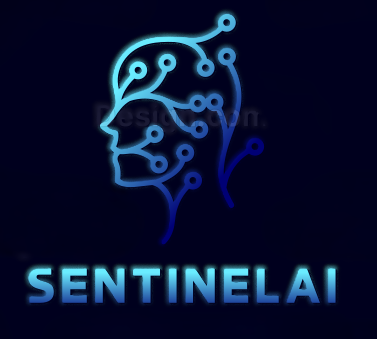
</p>

> **AI risk monitoring and observability for production LLM applications.** Catch hallucinations, jailbreak attempts, prompt injections, and unsafe outputs before they reach your users.

SentinelAI sits between your application and your AI model, analyzing every prompt and response pair in real-time. It detects fabricated claims, numeric inconsistencies, entity confusion, prompt injections, and adversarial inputs — then returns a **trust score**, an **explainable decision**, and optionally a **corrected response** you can serve immediately.

---

- [Product Vision](#product-vision)
- [Quick Start](#quick-start)
- [How It Works](#how-it-works)
- [Detection Capabilities](#detection-capabilities)
- [Understanding Results](#understanding-results)
- [SDK Reference](#sdk-reference)
- [API Endpoints](#api-endpoints)
- [Dashboard](#dashboard)
- [Architecture](#architecture)
- [Workspaces & Teams](#workspaces--teams)
- [Integration Patterns](#integration-patterns)
- [Configuration](#configuration)
- [Deployment](#deployment)
- [Testing](#testing)
- [Known Limitations](#known-limitations)
- [Roadmap](#roadmap)
- [Business Context](#business-context)
- [Security](#security)
- [Support](#support)

---

## Product Vision

> _A world where every organization can deploy AI with confidence, knowing that risk is visible, explainable, and controllable._

SentinelAI is the single pane of glass for AI risk — serving **engineers**, **security analysts**, **compliance officers**, and **executives** with role-appropriate views into the same trusted data. It connects security detection, explainable investigation, and compliance audit in a single workflow.

**Target ICP:** AI/ML engineers at mid-size SaaS companies (50–500 employees) shipping LLM-powered features in production. The Python SDK (`pip install sentinelai-sdk`) is designed for zero-friction adoption.

**Key differentiator vs. Langfuse, Arize, WhyLabs, Guardrails AI:** explainable, lightweight, real-time risk scoring with an agentic reasoning layer — not just passive logging or black-box scores.

---

## Quick Start

### 1. Sign up and create an organization

Go to [sentinelaihq.com](https://sentinelaihq.com) and sign in with GitHub or Google. You'll be prompted to create an organization — this is your team workspace where you manage API keys, invite members, and view risk logs.

### 2. Get your API key

Navigate to **API Keys** in your organization dashboard. Create a new key and copy it.

### 3. Install the SDK

```bash
pip install sentinelai-sdk
```

### 4. Analyze your first exchange

```python
from sentinelai import SentinelAIClient

client = SentinelAIClient(
    base_url="https://sentinel-ai-dml3.onrender.com",
    api_key="sk_your_api_key_here"
)

result = client.verify(
    prompt="What was Apple's revenue in 2025?",
    response="Apple reported $395 billion in revenue for fiscal year 2025."
)

print(result.score)       # 0-100 trust score
print(result.status)      # "trusted", "needs_review", or "hallucinated"
print(result.corrected)   # corrected version if hallucinations found
```

---

## How It Works

### Request Flow

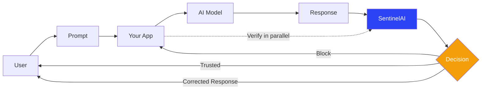

### Agentic Detection Pipeline

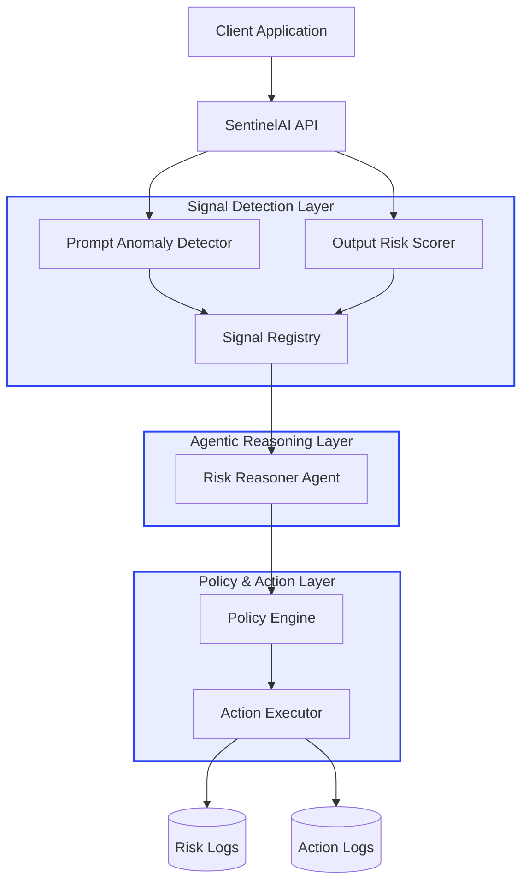

| Layer | Component | Responsibility |
|-------|-----------|----------------|
| **Signal Detection** | Prompt Anomaly Detector | Detects prompt injections, jailbreaks, adversarial inputs via embedding similarity |
| **Signal Detection** | Output Risk Scorer | Scores model outputs for hallucinations, fabrication, numeric drift |
| **Agentic Reasoning** | Risk Reasoner Agent | Aggregates signals, resolves conflicts, produces explainable risk decisions |
| **Policy & Action** | Policy Engine | Applies workspace thresholds (allow / warn / block / escalate) |
| **Policy & Action** | Action Executor | Executes decisions and writes immutable audit trail |

---

## Detection Capabilities

Every exchange goes through six parallel detectors:

| Detector | What It Catches |
|----------|----------------|
| **Unsupported Claim** | Statements of fact not backed by provided context |
| **Fabricated Citation** | References to papers, cases, or statistics that don't exist |
| **Numeric Drift** | Numbers or quantities inconsistent with source material |
| **Entity Confusion** | Conflating two similar people, places, or products |
| **Context Contradiction** | Response contradicts the prompt or conversation history |
| **Overconfidence Marker** | Definitive language around unverifiable claims |

Plus **prompt anomaly detection** via embedding similarity (distribution shift detection) and **rule-based output heuristics** for risky content patterns.

Each detector runs in parallel. The Risk Reasoner Agent aggregates results into a unified **0–100 trust score** with per-signal explainability.

### Multi-Turn Conversation Tracking

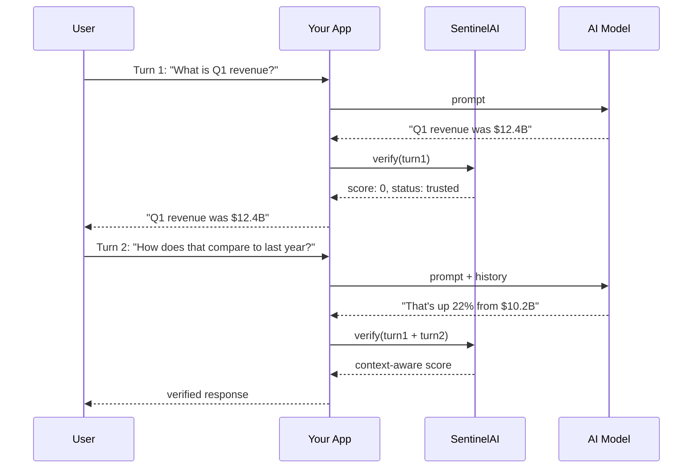

```python
from sentinelai import ConversationTracker

tracker = ConversationTracker(client, session_id="conv_001")
result = tracker.analyze_turn(
    prompt="User message",
    response="AI response"
)
# Automatically includes prior turns for context-aware detection
```

---

## Understanding Results

### Score Bands

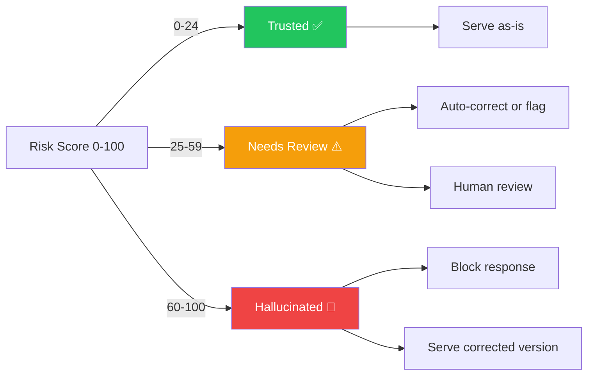

| Band | Score | What to Do |
|------|-------|------------|
| **Trusted** | 0–24 | No issues found. Serve the response as-is. |
| **Needs Review** | 25–59 | Minor concerns. Flag for human review or auto-correct low-risk spans. |
| **Hallucinated** | 60–100 | High-confidence fabrication. Block the response or serve the corrected version. |

### Correction

When the score is 25+, the response includes a `corrected` field — a rewritten version with flagged claims removed or fixed:

```python
if result.status == "hallucinated":
    return result.corrected  # serve the fix, not the flaw
```

### Explainability

Every decision includes human-readable explanations for each flag — token-level attribution showing which parts of the prompt or response contributed to the risk score. This is a key differentiator from black-box scoring systems.

---

## SDK Reference

### Python SDK

**Installation:**

```bash
pip install sentinelai-sdk
```

**SentinelAIClient:**

```python
from sentinelai import SentinelAIClient

client = SentinelAIClient(
    base_url="https://sentinel-ai-dml3.onrender.com",
    api_key="sk_...",
    source="my-app",        # optional: identifier for your application
    timeout=10,             # optional: request timeout in seconds
    max_retries=3           # optional: retry on transient errors
)
```

**Methods:**

| Method | Description |
|--------|-------------|
| `client.verify(prompt, response)` | One-shot verification. Returns `score`, `status`, `corrected`, `claims`. |
| `client.analyze(prompt, response, user_id?, session_id?)` | Full analysis with risk decision and audit logging. Returns `decision` ("allow" / "warn" / "block" / "escalate") and `corrected_response`. |
| `client.health_check()` | Check backend connectivity. |

```python
# verify — quick check
result = client.verify(
    prompt="What is the capital of France?",
    response="The capital of France is Paris."
)
print(result.score)   # 0
print(result.status)  # "trusted"

# analyze — production flow with audit logging
result = client.analyze(
    prompt="User message",
    response="AI response",
    user_id="user_123",
    session_id="session_456"
)

if result["decision"] == "block":
    return safe_fallback()
elif result["decision"] == "warn":
    log_for_review(result)
    return result["corrected_response"]
```

### TypeScript SDK

```typescript
import { SentinelAIClient } from "sentinelai-sdk";

const client = new SentinelAIClient({
  apiKey: "sk_...",
  baseURL: "https://sentinel-ai-dml3.onrender.com"
});

const result = await client.verify({
  prompt: userMessage,
  response: llmResponse,
});

if (result.status === "hallucinated") {
  return result.corrected;
}
```

---

## API Endpoints

Base URL: `https://sentinel-ai-dml3.onrender.com/api`

| Endpoint | Method | Description |
|----------|--------|-------------|
| `/analyze` | POST | Full risk analysis with audit logging |
| `/analyze/external` | POST | Analysis for external/existing logs |
| `/logs` | GET | List risk logs (paginated, filterable) |
| `/logs/{id}` | GET | Risk log detail with explanations |
| `/health` | GET | Backend health check |
| `/settings` | GET/PUT | Workspace risk thresholds and configuration |
| `/settings/history` | GET | Version history for settings changes |
| `/baselines` | GET/PUT | Baseline configuration for drift detection |

Interactive API docs: [sentinel-ai-dml3.onrender.com/api/docs](https://sentinel-ai-dml3.onrender.com/api/docs)

---

## Dashboard

The web dashboard at [sentinelaihq.com](https://sentinelaihq.com) provides an enterprise-grade AI risk monitoring interface with role-adaptive views for engineers, security analysts, compliance officers, and executives.

### Core Modules

| Module | Description |
|--------|-------------|
| **Dashboard** | AI Risk Health Score (0–100), active alerts by severity, top risks, 7-day trend chart, recent resolved events |
| **Risk Events** | Central triage surface — filterable event list, event detail with risk breakdown, token-level explanation, quick actions (block, escalate, dismiss), evidence export |
| **Investigations** | Deep-dive workspace with incident timeline, similar events panel, root cause analysis, token heatmap, evidence package generation (JSON + signed manifest) |
| **Models** | Model registry with per-model risk monitoring, baseline thresholds, drift history, guardrail rules, and audit log |
| **Analytics** | Risk trends (7d/30d/90d), model-to-model comparison, team metrics, compliance reporting |
| **Audit Logs** | Tamper-evident, immutable log of all configuration changes with hash chain verification |
| **Policies** | Guardrail rule engine — IF/THEN rule builder with dry-run testing against historical data, effectiveness metrics (TP/FP) |
| **API Usage** | Request volume, rate limit status, top consumers, cost estimates |
| **Team** | Role-based access control — invite members, manage roles (Viewer, Developer, Admin, Owner) |
| **Settings** | Workspace configuration, integrations (Slack, PagerDuty, webhooks), SSO/SAML, billing, API key management |

### Persona-Adaptive Views

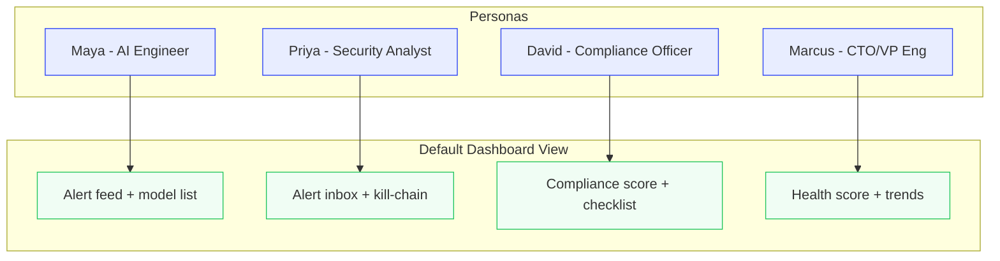

### Design System

The dashboard follows an authoritative, high-information-density design language inspired by CrowdStrike × Linear × Datadog × Stripe. Key elements:

- **Primary brand:** `#2B42F5` with Inter (UI) and JetBrains Mono (data) typography
- **4px base spacing system** for consistent rhythm across components
- **Severity colors** (red/amber/blue/green) with icon + text label — never color alone
- **Progressive disclosure** — headline first, detail on demand
- Full specification in `Docs/design-system.md`

---

## Architecture

### Production Stack

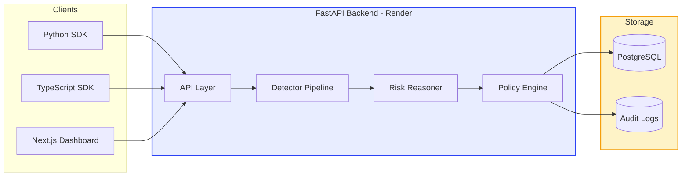

**Backend:** Python (FastAPI) with PostgreSQL persistence, modular detector pipeline, and agentic reasoning layer.

**Frontend:** Next.js 15 App Router, TypeScript (strict), Tailwind CSS v4, Zustand (client state), TanStack Query (server state), Observable Plot + Recharts (visualization), deployed on Vercel with Clerk authentication.

**SDK:** Python package published on PyPI (`pip install sentinelai-sdk`), TypeScript SDK in development.

### Production Docker Stack

For self-hosted deployments, the backend runs as a Docker Compose stack:

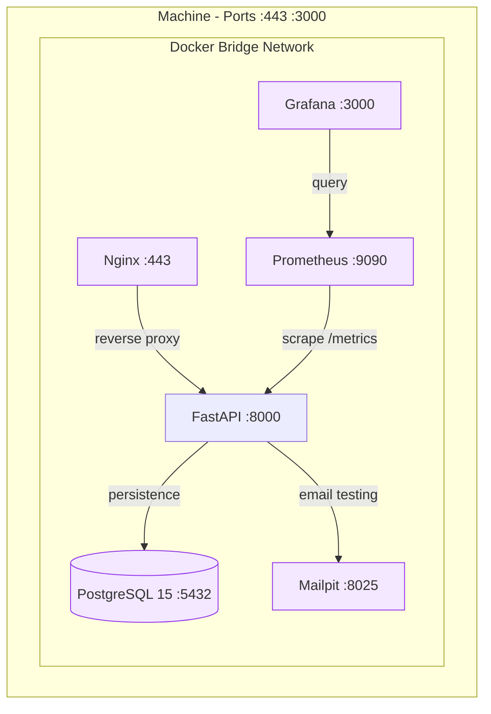

| Service | Role |
|---------|------|
| **Nginx** | Reverse proxy, SSL termination, rate limiting |
| **FastAPI (Uvicorn)** | Application server |
| **PostgreSQL 15** | Primary database |
| **Mailpit** | Email testing (SMTP :1025, WebUI :8025) |
| **Prometheus** | Metrics collection (scrapes `/metrics`) |
| **Grafana** | Dashboards and visualization |

All services run on a dedicated Docker bridge network. Only Nginx exposes ports to the host.

---

## Workspaces & Teams

Organizations can have multiple workspaces with independent settings, API keys, and risk logs — useful for separating development, staging, and production environments.

### Roles

| Role | Permissions |
|------|-------------|
| **Viewer** | View logs and dashboards only |
| **Developer** | View logs, run analysis, manage API keys |
| **Admin** | Full workspace management, invite members |
| **Owner** | All permissions + billing and workspace deletion |

---

## Integration Patterns

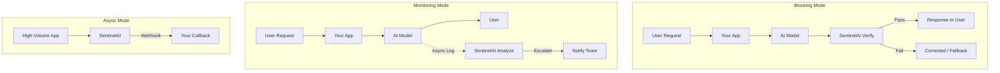

### Blocking Mode

Verify every response before it reaches the user. Block or correct unsafe responses.

```python
response = get_llm_response(prompt)
result = client.verify(prompt, response)
return result.corrected if result.corrected else response
```

### Monitoring Mode

Log all exchanges for analysis without blocking. Review flagged responses later.

```python
result = client.analyze(prompt, response, user_id=user.id)
if result["decision"] == "escalate":
    notify_team(result)
```

### Async Mode

Fire-and-forget verification for high-throughput applications. Process results asynchronously via webhook callbacks.

### Self-Hosted Mode

Deploy the backend on your own infrastructure. No customer data leaves your network. See `Docs/operations/DEPLOYMENT_GUIDE.md` for instructions.

---

## Configuration

### Risk Thresholds

Configure per-workspace thresholds in the dashboard under **Settings** or via the API:

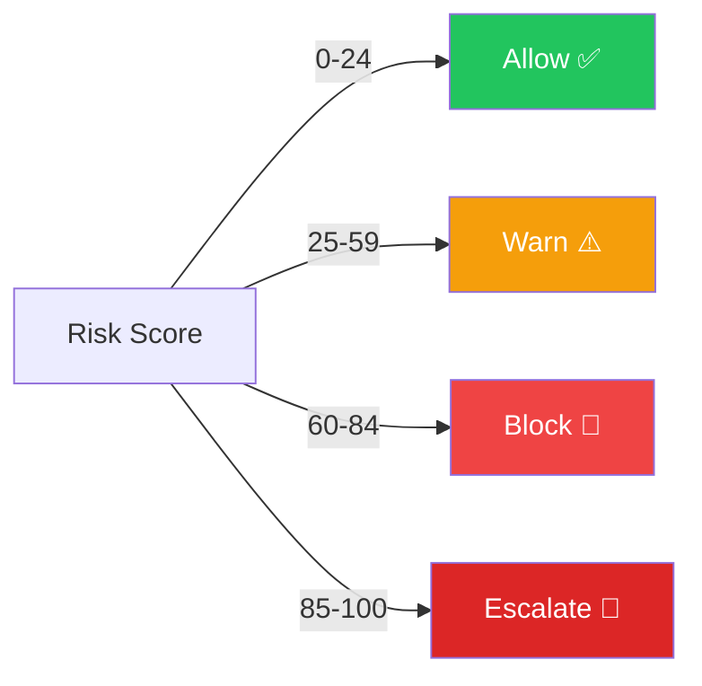

| Threshold | Description | Default |
|-----------|-------------|---------|
| Allow max | Maximum score to allow without review | 24 |
| Warn min | Minimum score to flag for review | 25 |
| Block min | Minimum score to block | 60 |
| Escalate min | Minimum score to notify admins | 85 |

Settings are versioned with full history — every change is logged in the immutable audit trail.

### Baselines

Configure baseline profiles for distribution shift detection. When prompt embeddings deviate significantly from the baseline (e.g., >2σ), the system flags an anomaly.

---

## Deployment

### Production URLs

| Component | URL |
|-----------|-----|
| Dashboard | [sentinelaihq.com](https://sentinelaihq.com) |
| API | [sentinel-ai-dml3.onrender.com](https://sentinel-ai-dml3.onrender.com) |
| API Docs | [sentinel-ai-dml3.onrender.com/api/docs](https://sentinel-ai-dml3.onrender.com/api/docs) |

### Local Development

```bash
# Backend
cd Backend
cp .env.example .env
pip install -r requirements.txt
uvicorn main:app --reload --port 8001

# Frontend
cd Frontend
npm install
npm run dev
```

### Docker (Self-Hosted)

```bash
cd Backend
docker compose up
```

This starts the API, PostgreSQL, Nginx, Mailpit, Prometheus, and Grafana. See `Docs/operations/` for full deployment guides, runbooks, and incident response procedures.

### CI/CD

Automated testing and deployment via GitHub Actions. See `Docs/TESTING.md` for test configuration and coverage requirements.

---

## Testing

The backend test suite covers:

- **Unit tests:** Detector logic, scoring algorithms, policy engine
- **Integration tests:** API endpoints, database interactions, full analysis pipeline
- **Fixtures:** Sample prompts and responses for each detection category

```bash
cd Backend
pytest --cov=. --cov-report=term-missing
```

See `Docs/TESTING.md` and `Docs/PHASE1_TEST_GUIDE.md` for detailed test plans.

---

## Known Limitations

| Category | Limitation |
|----------|------------|
| **Detection** | Rule-based heuristics may generate false positives |
| **Detection** | Novel prompt patterns may bypass anomaly detection |
| **Detection** | Risk scoring is coarse and not probabilistic |
| **System** | Thresholds require manual tuning (no auto-calibration in MVP) |
| **System** | Monitoring adds slight latency to requests (~100–300ms) |
| **System** | MVP does not learn automatically from feedback |
| **Safety** | SentinelAI cannot prevent misuse, only flag it |
| **Safety** | Detection does not imply correctness of judgment |

See `Docs/FAILURE_MODES.md` for the full document.

---

## Roadmap

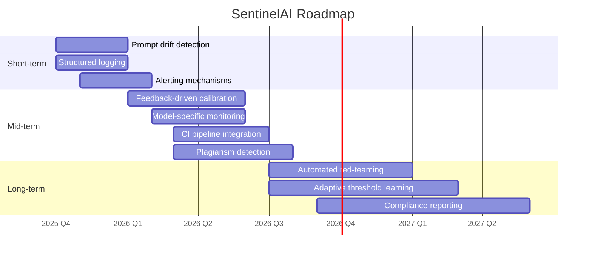

### Short-term
- Improve prompt drift detection
- Structured logging and filtering
- Basic alerting mechanisms

### Mid-term
- Feedback-driven risk calibration
- Model-specific monitoring profiles
- CI/evaluation pipeline integration
- Plagiarism and hallucination detection modules

### Long-term
- Automated red-teaming hooks
- Adaptive threshold learning (auto-baselining)
- Organization-level safety dashboards
- Full compliance reporting (EU AI Act, SOC 2, ISO 42001)

See `Docs/ROADMAP.md` and `Docs/FUTURE_SCOPE_OF_MVP.md` for more detail.

---

## Business Context

### Competitive Landscape

| Tool | Gap Sentinel Fills |
|------|--------------------|
| **Langfuse** | Tracing/observability focus; no real-time risk scoring or intervention |
| **Arize AI** | Powerful but heavyweight/expensive; overkill for mid-size teams |
| **WhyLabs** | Data drift detection; not LLM-output-specific, less explainable |
| **Guardrails AI** | Input/output validation but rule-heavy; no unified risk score or agentic layer |

SentinelAI's position: **explainable, lightweight, real-time risk scoring with a Python SDK that gets you running in 3 lines** — not just passive logging.

### Business Model

- **Free:** Self-hosted, open-source, community support
- **Pro:** Managed cloud, dashboards, alerting, settings history
- **Enterprise:** SLAs, SSO, audit logs, custom data retention, compliance reports

### Current Stage

Working MVP with core detection pipeline, FastAPI backend, Python SDK (on PyPI), and React dashboard. Deployed on Render + Vercel. Seeking first design partners and open-source early adopters.

### Company Values

- **Explainability first** — every signal should be understandable, not just a score
- **Lightweight by design** — 3-line SDK integration, no vendor lock-in
- **Engineer empathy** — built by engineers who felt the pain
- **Honest about limits** — we flag risk, we don't guarantee safety
- **Open by default** — open-source core as trust-building mechanism

---

## Security

- Authentication via Clerk (production mode, `pk_live_*`) with GitHub and Google OAuth
- Role-based access control per workspace (Viewer, Developer, Admin, Owner)
- API key authentication for SDK requests (`sk_*` keys)
- All analysis results logged with full immutable audit trail
- Hash-chain verification for audit log integrity
- No customer data stored in self-hosted mode
- SSL termination via Nginx in production deployments

---

## Support

- **Dashboard:** [sentinelaihq.com](https://sentinelaihq.com)
- **GitHub Issues:** Bug reports and feature requests
- **Email:** `support@sentinelai.dev`

---

*SentinelAI — Making AI systems observable and safe by default.*
