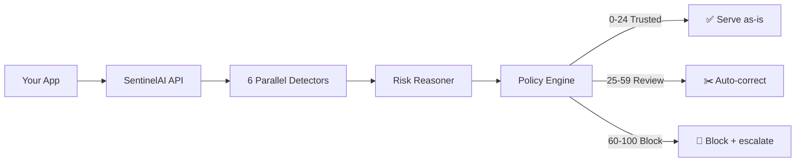

<p align="center">
  
</p>

<p align="center">
  <b>AI risk monitoring for production LLMs.</b><br>
  Catch hallucinations, prompt injections, and jailbreaks <i>before</i> they reach your users.
</p>

<p align="center">
  <a href="https://sentinelaihq.com">Live Demo</a> ·
  <a href="https://sentinel-ai-dml3.onrender.com/api/docs">API Docs</a> ·
  <a href="https://pypi.org/project/sentinelai-sdk/">PyPI</a>
</p>

---

## What is this?

SentinelAI sits between your app and your LLM, analyzing every prompt/response pair in real-time. It returns a **trust score (0–100)**, tells you *why*, and can auto-correct risky responses — so you serve the fix, not the flaw.

LLMs hallucinate. They invent citations, flip numbers, and mix up entities. SentinelAI is the safety net your AI feature needs before you ship it.

## Why you'll love it

- 🛡️ **6 detectors in parallel** — fake citations, numeric drift, entity confusion, contradictions, unsupported claims, overconfidence
- 🎯 **Explainable, not a black box** — every score comes with token-level reasons
- ✂️ **Auto-correction** — blocked? We return a cleaned response to serve instead
- 🧠 **Conversation-aware** — tracks context across multi-turn chats
- ⚡ **3-line setup** — no pipelines, no config, no lock-in

## Quick start

```bash
pip install sentinelai-sdk
```

```python
from sentinelai import SentinelAIClient

client = SentinelAIClient(api_key="sk_...")

result = client.verify(prompt=prompt, response=llm_output)

if result.status == "hallucinated":
    return result.corrected  # serve the fix, not the flaw
```

That's it. You're live in under 60 seconds.

## How it works



- **Trusted (0–24)** — serve it
- **Needs review (25–59)** — auto-correct or flag for humans
- **Hallucinated (60–100)** — block and escalate

## Where you can use it

| Mode | Use case |
|------|----------|
| **Blocking** | Verify every response before it hits your user |
| **Monitoring** | Log everything, review flagged ones later |
| **Async** | High-throughput: fire-and-forget + webhooks |
| **Self-hosted** | Keep all data on your own infra |

## Pricing

| Plan | What you get |
|------|--------------|
| **Free** | Self-hosted, open source, community support |
| **Pro** | Managed cloud, dashboard, alerting, settings history |
| **Enterprise** | SLAs, SSO, audit logs, custom retention, compliance reports |

## Roadmap

Short term: better prompt drift detection, structured logging, alerting.
Next: feedback-driven calibration, CI/eval integration, automated red-teaming, EU AI Act / SOC 2 / ISO 42001 compliance reporting.

## Built for teams shipping AI

Made for AI/ML engineers at 50–500 person SaaS companies who want confidence, not complexity. Unlike observability tools that just log, SentinelAI **acts** — scoring, correcting, and escalating in real time.

---

<p align="center">
  <a href="https://sentinelaihq.com">Dashboard</a> ·
  <a href="https://github.com/">GitHub</a> ·
  <a href="mailto:support@sentinelai.dev">support@sentinelai.dev</a>
</p>

<p align="center"><i>Making AI systems observable and safe by default.</i></p>