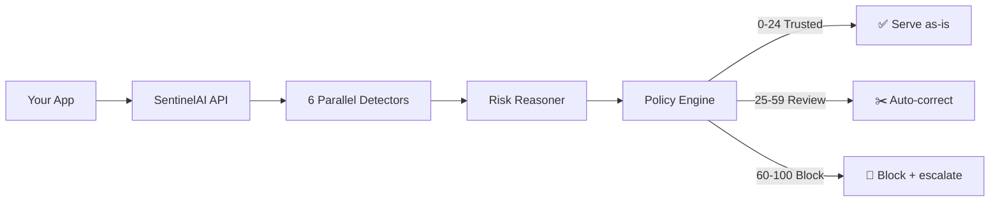

<p align="center">
  
</p>

<p align="center">
  <b>AI risk monitoring for production LLMs.</b><br>
  Catch hallucinations, prompt injections, and jailbreaks <i>before</i> they reach your users.
</p>

<p align="center">
  <a href="https://sentinelaihq.com"><b>Live Demo</b></a> ·
  <a href="https://sentinel-ai-dml3.onrender.com/api/docs">API Docs</a> ·
  <a href="https://pypi.org/project/sentinelai-sdk/">PyPI</a>
</p>

<p align="center">
  
  
  
</p>

---

LLMs are confident. They're also wrong — inventing citations, flipping numbers, and blending entities with zero hesitation. **SentinelAI sits between your app and your LLM**, scoring every prompt/response pair in real time, explaining the risk, and acting on it — before bad output reaches a user.

## What SentinelAI does

- 🛡️ **6 detectors in parallel** — fabricated citations, numeric drift, entity confusion, context contradictions, unsupported claims, overconfidence
- 🎯 **Explainable risk, not a black box** — every score ships with token-level reasons you can read and trust
- ✂️ **Auto-correction** — when a response is risky, get a cleaned version to serve instead
- 🧠 **Conversation-aware** — risk is judged across multi-turn context, not in isolation
- 📦 **3-line SDK** — `pip install sentinelai-sdk` and you're live. No pipelines, no config sprawl
- 🏠 **Self-hostable** — open-source core. Your data stays on your infra

## 60-second quick start

```bash
pip install sentinelai-sdk
```

```python
from sentinelai import SentinelAIClient

client = SentinelAIClient(api_key="sk_...")

result = client.verify(prompt=prompt, response=llm_output)

if result.status == "hallucinated":
    return result.corrected  # serve the fix, not the flaw
```

Every response is now scored, explained, and protected. That's the whole integration.

## How it works



- **Trusted (0–24)** — serve it
- **Needs review (25–59)** — auto-correct or flag for humans
- **Hallucinated (60–100)** — block and escalate

## Where it runs

| Mode | Use case |
|------|----------|
| **Blocking** | Verify every response before it hits your user |
| **Monitoring** | Log everything, review flagged ones later |
| **Async** | High-throughput: fire-and-forget + webhooks |
| **Self-hosted** | Keep all data on your own infra |

## Pricing

| Plan | What you get |
|------|--------------|
| **Free** | Self-hosted, open source, community support |
| **Pro** | Managed cloud, dashboard, alerting, settings history |
| **Enterprise** | SLAs, SSO, audit logs, custom retention, compliance reports |

## Get involved

- ⭐ Star the repo and help us reach 100 stars — that's our launch milestone
- 🐛 Found a false positive? Open an issue — we read every one
- 💬 Questions? [support@sentinelai.dev](mailto:support@sentinelai.dev)
- 🚀 Ready to try it? [Launch the live demo](https://sentinelaihq.com)

---

<p align="center">
  <a href="https://sentinelaihq.com">Dashboard</a> ·
  <a href="https://github.com/Blacksujit/Sentinel-AI">GitHub</a> ·
  <a href="https://sentinel-ai-dml3.onrender.com/api/docs">API Docs</a>
</p>

<p align="center"><i>Making AI systems observable and safe by default.</i></p>