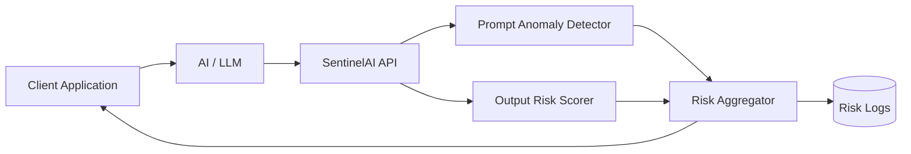
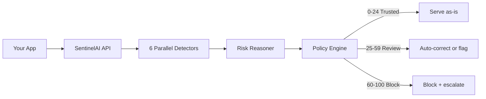

<p align="center">
  
</p>

<h3 align="center">AI risk monitoring for production LLMs</h3>

<p align="center">
  Catch hallucinations, prompt injections, and jailbreaks <b>before</b> they reach your users —
  with a score, a reason, and an action for every response.
</p>

<p align="center">
  <a href="https://pypi.org/project/sentinelai-risk/"></a>
  <a href="https://pypi.org/project/sentinelai-risk/"></a>
  <a href="LICENSE"></a>
  <a href="https://blacksujit.github.io/Sentinel-AI/"></a>
</p>

<p align="center">
  <a href="https://sentinelaihq.com"><b>Live Demo</b></a>
  &nbsp;•&nbsp;
  <a href="https://blacksujit.github.io/Sentinel-AI/"><b>Documentation</b></a>
  &nbsp;•&nbsp;
  <a href="https://sentinel-ai-dml3.onrender.com/api/docs">API Reference</a>
  &nbsp;•&nbsp;
  <a href="https://pypi.org/project/sentinelai-risk/">PyPI</a>
</p>

---

## The problem

LLMs are confident — and wrong. They invent citations, flip numbers, and blend
entities with zero hesitation. Most teams find out after a bad response reaches
a user, or from a compliance auditor.

SentinelAI sits between your app and your LLM, scoring every prompt/response
pair in real time. Six detectors run in parallel, every score ships with
token-level reasons, and your policy decides the action: serve, auto-correct,
or block.

**No black boxes. Every verdict explains itself.**

## Quick start

```bash
pip install sentinelai-risk
```

```python
from sentinelai import SentinelAIClient

client = SentinelAIClient(api_key="sk_...")

prompt = "What was Q3 revenue?"
llm_output = "Revenue grew 45% year over year."

result = client.verify(prompt=prompt, response=llm_output)

if result.status == "hallucinated":
    print(result.corrected)  # serve the fix, not the flaw
else:
    print(result.trust_score, result.reasons)
```

Live in under 60 seconds. See the
[quickstart guide](https://blacksujit.github.io/Sentinel-AI/docs/quickstart)
for configuration, deployment modes, and self-hosting.

## Architecture

SentinelAI is model-agnostic and minimally invasive — it observes
prompt/response pairs and never sits in the generation path:



1. The client application sends prompt and model response to SentinelAI
2. Prompt anomaly detection checks for distribution shifts
3. Output risk scoring flags unsafe or unstable responses
4. Risk signals are aggregated into a unified score
5. Results are returned and optionally logged for review

## How a response is scored



| Trust score | Status | Default action |
|-------------|--------|----------------|
| 0–24 | Trusted | Serve as-is |
| 25–59 | Needs review | Auto-correct or flag for humans |
| 60–100 | Hallucinated | Block and escalate |

## Deployment modes

| Mode | Use case |
|------|----------|
| **Blocking** | Verify every response before it hits your user |
| **Monitoring** | Log everything, review flagged ones later |
| **Async** | High-throughput: fire-and-forget + webhooks |
| **Self-hosted** | Keep all data on your own infrastructure |

## What you get back

| Field | Meaning |
|-------|---------|
| `status` | `trusted`, `needs_review`, or `hallucinated` |
| `trust_score` | 0 (safe) to 100 (critical risk) |
| `reasons` | Token-level explanations for every flag |
| `corrected` | A cleaned response when auto-correction applies |

## Features

- **Six detectors in parallel** — fabricated citations, numeric drift, entity
  confusion, contradictions, unsupported claims, overconfidence
- **Explainable risk** — every score ships with token-level reasons, no black boxes
- **Auto-correction** — serve a cleaned response instead of a risky one
- **Conversation-aware** — risk judged across multi-turn context, not in isolation
- **3-line SDK** — `pip install sentinelai-risk` and you are live
- **Self-hostable** — open-source core, your data stays on your infrastructure

## Documentation

Full docs — trust score, detectors, deployment modes, API reference, and
self-hosting — live at **https://blacksujit.github.io/Sentinel-AI/**.

The docs site is a static Next.js/Fumadocs build in [`docs-site/`](docs-site),
exported with a `/Sentinel-AI` base path and deployed to GitHub Pages by
[`.github/workflows/pages.yml`](.github/workflows/pages.yml) on every push to
`main`.

```bash
cd docs-site
npm install
npm run dev
```

## Repository layout

| Path | Contents |
| --- | --- |
| `docs-site/` | Documentation website (Next.js + Fumadocs, static export) |
| `Backend/` | SentinelAI API backend (FastAPI) |
| `Frontend/` | Web dashboard |
| `sentinelai-sdk/` | Python SDK (published as `sentinelai-risk`) |
| `Docs/` | Source documentation & design notes |

## Roadmap

- Prompt drift detection, structured logging, alerting
- Feedback-driven calibration, CI/eval integration, automated red-teaming
- EU AI Act / SOC 2 / ISO 42001 compliance reporting

## License

[MIT](LICENSE)