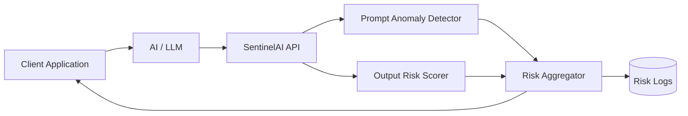
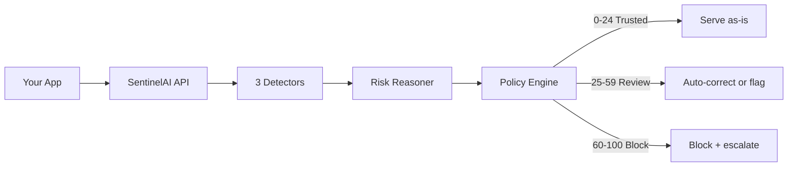

<p align="center">
  
</p>

<h3 align="center">AI risk monitoring for production LLMs</h3>

<p align="center">
  Score every prompt/response pair in real time — with a score, a reason,
  and an action for each verdict.
</p>

<p align="center">
  <a href="https://pypi.org/project/sentinelai-risk/"></a>
  <a href="https://pypi.org/project/sentinelai-risk/"></a>
  <a href="LICENSE"></a>
  <a href="https://blacksujit.github.io/Sentinel-AI/"></a>
</p>

<p align="center">
  <a href="https://sentinelaihq.com"><b>Live</b></a>
  &nbsp;•&nbsp;
  <a href="https://blacksujit.github.io/Sentinel-AI/"><b>Documentation</b></a>
  &nbsp;•&nbsp;
  <a href="https://sentinel-ai-dml3.onrender.com/api/docs">API Reference</a>
  &nbsp;•&nbsp;
  <a href="https://pypi.org/project/sentinelai-risk/">PyPI</a>
</p>

---

## What it does

SentinelAI sits between your app and your LLM. It scores every prompt/response
pair in real time, flags risky or unsupported content, and lets your policy
decide the action: serve, auto-correct, or block. Every verdict ships with the
claims and flags that produced it.

## Quick start

```bash
pip install sentinelai-risk
```

```python
from sentinelai import SentinelAIClient

client = SentinelAIClient(api_key="your-api-key")

prompt = "Our refund policy is 60 days."
response = "We offer 30-day refunds."

result = client.verify(prompt=prompt, response=response)

if result["status"] == "hallucinated":
    print(result["corrected"])        # "We offer 60-day refunds."
else:
    print(result["score"], result["status"], result["claims"])
```

`verify()` returns a dict (see [What you get back](#what-you-get-back)). For
configuration, deployment, and self-hosting see the
[quickstart guide](https://blacksujit.github.io/Sentinel-AI/docs/quickstart).

## Architecture

SentinelAI is model-agnostic. It observes prompt/response pairs and never sits
in the generation path:



1. The client application sends prompt and model response to SentinelAI
2. Prompt anomaly detection checks for distribution shifts
3. Output risk scoring flags unsafe or unstable responses
4. Risk signals are aggregated into a unified score
5. Results are returned and optionally logged for review

## How a response is scored



Three detectors run on each request:

| Detector | Side | What it checks |
|----------|------|----------------|
| **Prompt anomaly** | Prompt | Distribution shift vs. baseline prompts (similarity heuristics) |
| **Jailbreak RAG** | Prompt | Semantic match against known jailbreak patterns (embeddings + cosine similarity) |
| **Output risk** | Response | 8 content categories: violence, hate speech, self-harm, illegal activity, misinformation, privacy violation, inappropriate content, harmful instructions |

The SDK's `verify()` adds local factual-claim checking: it extracts
numeric/quantity claims from the response and cross-checks each against the
prompt context, marking them `consistent`, `unverified`, or `contradicted`,
and auto-corrects contradictions where the prompt supplies the right value.

| Score | Status | Default action |
|-------|--------|----------------|
| 0–24 | `trusted` | Serve as-is |
| 25–59 | `needs_review` | Auto-correct or flag for review |
| 60–100 | `hallucinated` | Block and escalate |

Higher score = higher risk.

## Deployment modes

| Mode | Use case |
|------|----------|
| **Blocking** | Verify every response before it reaches your user |
| **Monitoring** | Log everything, review flagged ones later |
| **Async** | High-throughput: fire-and-forget + webhooks |
| **Self-hosted** | Keep all data on your own infrastructure |

## What you get back

`verify()` returns a dict with these fields:

| Field | Meaning |
|-------|---------|
| `score` | 0 (safe) to 100 (critical risk) |
| `status` | `trusted`, `needs_review`, or `hallucinated` |
| `claims` | Per-claim verdicts (`text`, `verdict`, `note`) |
| `corrected` | A cleaned response when auto-correction applies, else `None` |
| `decision` | Backend decision (`allow` / `warn` / `block` / `escalate`) |
| `meta` | Counts: claims checked, contradictions, unverified, timestamp |

## Features

- **Three detectors** — prompt anomaly, jailbreak RAG, output risk (8 categories)
- **Explainable** — every score ships with the claims/flags that produced it
- **Auto-correction** — serve a cleaned response instead of a risky one
- **Conversation-aware** — risk judged across multi-turn context via `ConversationTracker`
- **Self-hostable** — open-source core, your data stays on your infrastructure

## Documentation

Full docs — scoring, detectors, deployment modes, API reference, and
self-hosting — live at **[Docs](https://blacksujit.github.io/Sentinel-AI/)**.

<!-- The docs site is a static Next.js + Fumadocs build in [`docs-site/`](docs-site),
exported with a `/Sentinel-AI` base path and deployed to GitHub Pages by
[`.github/workflows/pages.yml`](.github/workflows/pages.yml) on every push to
`main`. -->
<!-- 
```bash
cd docs-site
npm install
npm run dev
``` -->

## Repository layout

| Path | Contents |
| --- | --- |
| `Backend/` | SentinelAI API backend (FastAPI, `uvicorn main:app`) |
| `Frontend/` | Web dashboard (Next.js) |
| `sentinelai-sdk/` | Python SDK (published as `sentinelai-risk` on PyPI) |
| `docs-site/` | Documentation website (Next.js + Fumadocs, static export) |
| `Docs/` | Source documentation & design notes |

## Roadmap

- Prompt drift detection, structured logging, alerting
- Feedback-driven calibration, CI/eval integration, automated red-teaming
- EU AI Act / SOC 2 / ISO 42001 compliance reporting

## License

[MIT](LICENSE)
